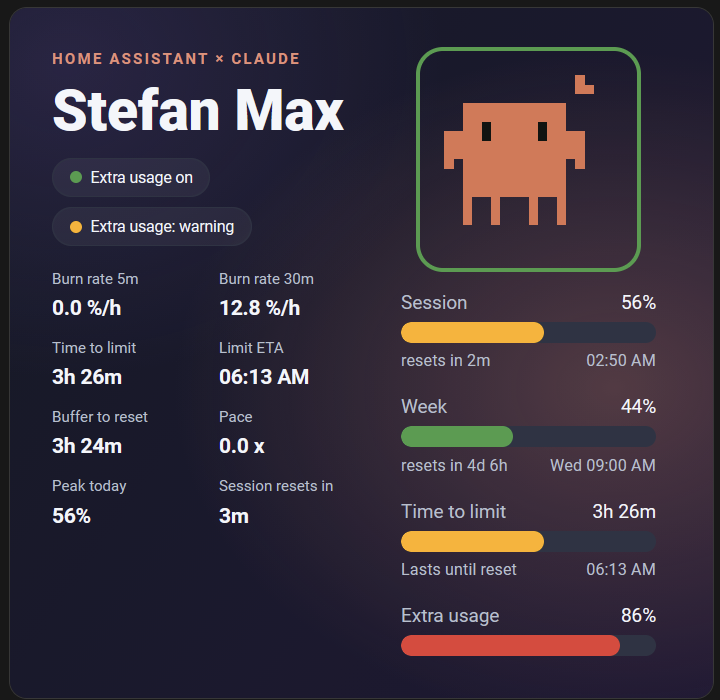

# Clawdmeter Card

> ## ⚠️ WORK IN PROGRESS — NOT TESTED, NOT FOR USERS YET
>
> **This card has not been tested and is _not_ ready to install or even to try out.**
> It is published here only so development can happen in the open. Do **not** add it to
> Home Assistant yet: it may not render, it may break, and it will change without notice.
> There is intentionally **no release** — treat everything here as unfinished.



An animated Lovelace card for the
[Clawdmeter](https://github.com/corgan2222/ha-clawdmeter) integration. It is meant to show
Claude usage (session / weekly limits, burn rate, runway, time‑to‑limit) as an animated
pixel‑art creature, mirroring the ESPHome Clawdmeter display.

The custom element is `clawdmeter-card` (so eventually: `type: custom:clawdmeter-card`).

## Status

🚧 **Pre‑alpha.** It now renders in a real Home Assistant dashboard and ships a visual editor,
but it is still pre‑release, has no tagged release, and may change without notice. Do not rely
on it yet.

## Configuration

The card ships a **visual editor** — no YAML required. Open the card's edit dialog and pick your
Clawdmeter **account**; every entity is filled in automatically (matched by the integration's
translation keys, so it is language‑independent). You can also choose the **layout**
(`panel` / `hero`), set an optional **title**, and toggle each element via checkboxes, grouped as:

- **General** — title, creature, header line, background
- **Bars** — session, week, time‑to‑limit, Sonnet, Opus, extra usage
- **Values** — burn rate (5m / 30m), time to limit, limit ETA, buffer to reset, pace,
  peak today, session reset‑in

The "time‑to‑limit" bar tracks session usage toward the limit (severity‑coloured) and shows
the projected ETA, mirroring the ESPHome Clawdmeter. The card follows your Home Assistant
language (English and German included) and adapts to light/dark themes.

### YAML (optional)

```yaml
type: custom:clawdmeter-card
layout: panel # or: hero
title: Clawdmeter # optional
show: # optional per-element visibility
  background: true
  creature: true
  sonnet: false
# entity ids (session_usage, week_usage, time_to_limit, …) are filled by the editor
```

## Installation

Not available yet. Once the card is actually tested and released, installation instructions
(HACS custom repository + dashboard resource) will be added here.

## License

[MIT](LICENSE)
