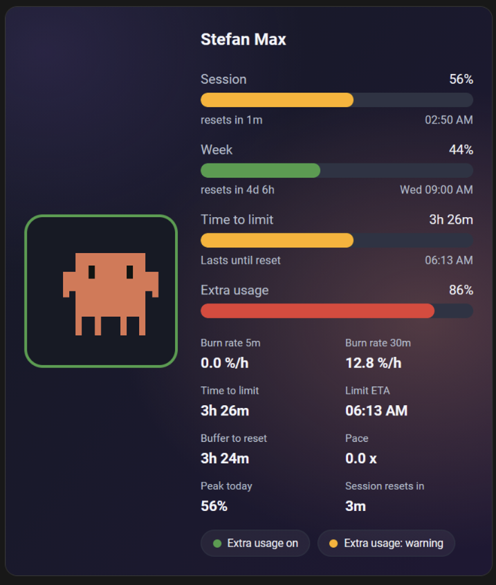
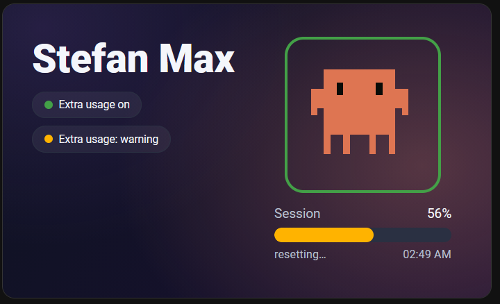
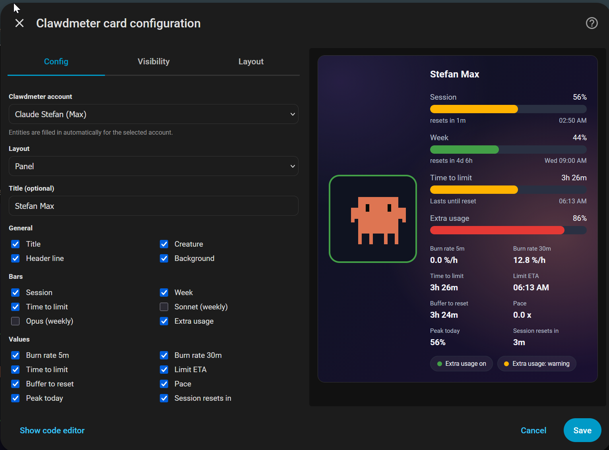
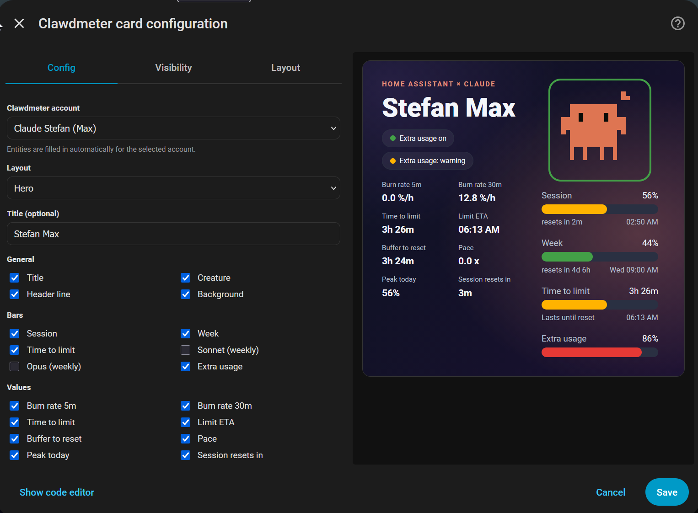
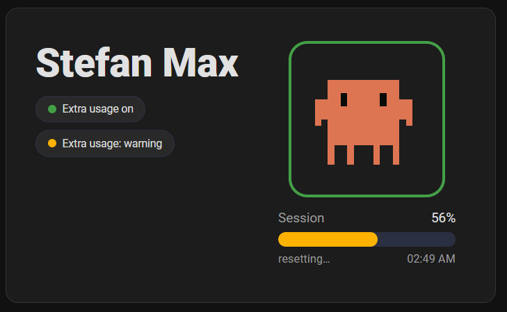

<p align="center">
  
</p>

<h1 align="center">Clawdmeter Card — Animated Claude Usage for Home Assistant</h1>

<p align="center"><em>Your Claude usage as a living pixel-art creature on the dashboard.</em></p>

<p align="center">
  <a href="https://hacs.xyz"></a>
  
  
  
</p>

<p align="center">
  <a href="https://my.home-assistant.io/redirect/hacs_repository/?owner=corgan2222&repository=lovelace-clawdmeter&category=plugin"></a>
</p>

<p align="center">
  <a href="https://github.com/corgan2222/esphome-modular-lvgl-buttons"></a>
  <a href="https://github.com/corgan2222/ha-clawdmeter"></a>
  <a href="https://github.com/corgan2222/lovelace-clawdmeter"></a>
</p>

An animated Lovelace card for the
[Clawdmeter](https://github.com/corgan2222/ha-clawdmeter) integration. It is meant to show
Claude usage (session / weekly limits, burn rate, runway, time‑to‑limit) as an animated
pixel‑art creature, mirroring the ESPHome Clawdmeter display.

The custom element is `clawdmeter-card` (use `type: custom:clawdmeter-card`).

## ✨ Highlights

- **Animated pixel-art creature** — its mood (idle → heavy) follows your burn rate, and the frame glows green/orange/red with the runway pace.
- **Two layouts** — `panel` and `hero`, switchable in the visual editor.
- **Visual editor, no YAML** — pick your Clawdmeter account and every entity is filled in automatically (matched by the integration's translation keys, so it is language-independent).
- **Session, weekly, Sonnet & Opus bars** plus burn rate, time-to-limit, ETA, pace and peak values.
- **Theme-aware** — adapts to light/dark themes; turn the background off to blend into your own theme.
- **English & German**, following your Home Assistant language.

<p align="center">
  
</p>

## Status

🧪 **Beta (`v0.0.2`).** The card renders in a real Home Assistant dashboard and ships a
visual editor. It is usable day-to-day, but still maturing — expect the odd rough edge and
some changes between versions. Bug reports and ideas are welcome via the issue templates.

## Layouts

Two layouts, switchable in the editor.

### Panel



### Hero



## Configuration

The card ships a **visual editor** — no YAML required. Open the card's edit dialog and pick your
Clawdmeter **account**; every entity is filled in automatically (matched by the integration's
translation keys, so it is language‑independent). You can also choose the **layout**
(`panel` / `hero`), set an optional **title**, and toggle each element via checkboxes, grouped as:

- **General** — title, creature, header line, background
- **Bars** — session, week, time‑to‑limit, Sonnet, Opus, extra usage
- **Values** — burn rate (5m / 30m), time to limit, limit ETA, buffer to reset, pace,
  peak today, session reset‑in

The "time‑to‑limit" bar tracks session usage toward the limit (severity‑coloured) and shows
the projected ETA, mirroring the ESPHome Clawdmeter. The card follows your Home Assistant
language (English and German included) and adapts to light/dark themes.

The visual editor (panel and hero):





With the **background** turned off, the card uses your theme's card background, so it fits a light theme too:



### YAML (optional)

```yaml
type: custom:clawdmeter-card
layout: panel # or: hero
title: Clawdmeter # optional
show: # optional per-element visibility
  background: true
  creature: true
  sonnet: false
# entity ids (session_usage, week_usage, time_to_limit, …) are filled by the editor
```

## Installation

### HACS (recommended)

1. In HACS, open the menu (⋮) → **Custom repositories**.
2. Add `https://github.com/corgan2222/lovelace-clawdmeter` with category **Dashboard**.
3. Search for **Clawdmeter Card**, install it, then reload your browser.
4. Add the card to a dashboard — the visual editor fills in your Clawdmeter account automatically.

You also need the [Clawdmeter integration](https://github.com/corgan2222/ha-clawdmeter) for the
underlying sensors.

### Manual

Copy `clawdmeter.js` to `config/www/` and add it as a dashboard resource
(`/local/clawdmeter.js`, type _JavaScript Module_), or load it via `lovelace.resources` /
`frontend.extra_module_url`.

## Credits

- [HermannBjorgvin/Clawdmeter](https://github.com/HermannBjorgvin/Clawdmeter) — the original creature and concept.
- [trickv/hass-claude-usage](https://github.com/trickv/hass-claude-usage) — the reference integration this build reworks.
- [esphome-modular-lvgl-buttons](https://github.com/corgan2222/esphome-modular-lvgl-buttons) — the ESPHome Clawdmeter display.
- [claudepix.vercel.app](https://claudepix.vercel.app/) — the pixel-art creature animations.

## License

[MIT](LICENSE)
